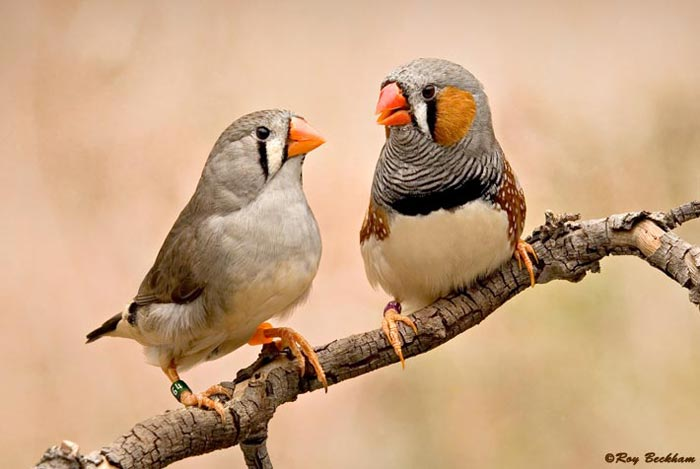

## Final-Project
Gabriela M. de Pinho

### Background and biological question

  Vocal communication ability is not universal among vertebrates; it is found in teleost fishes, frogs and toads, mammals, turtles, lizards, and birds Adkins-Regan (2005). Among these vocal vertebrates, few groups have the additional capacity for vocal learning, and include parrots, hummingbirds, songbirds, macaques, humans, some bats, cetaceans and elephants (Condro & White, 2014; White, 2010). Vocal learning, a sub-component of language, is the ability of an individual to modify its own vocalization from observing and mimicking a vocal model (Teramitsu, Kudo, London, Geschwind, & White, 2004), and apparently evolved independently in several lineages (Jarvis et al., 2014). Among vocal-learners, the zebra finch (a songbird) is the principal model species for studies on the internal mechanisms that influence vocalization and leaning (Condro & White, 2014; Remage-Healey, 2012).


Figure 1: A male zebra finch.


  Pfenning et al. (2014) used anatomical gene expression specialization trees—hierarchically organized brain regions, subregions and their gene expression profiles—to identify particularities of  the only three lineages of avian vocal learners and humans in relation to vocal non-learners. As result, they found that all vocal-learning birds and humans show convergent gene expression specialization in regions that control the behavior, which was absent in vocal non-learners, and concluded that avian vocal-learners can be used as models for speech at a molecular level (Pfenning et al., 2014).There are three studies describing genes related to vocal learning or regulated by vocalization. First, Hilliard et al. (2012) described approximately 2,000 genes regulated during vocal behavior and described pathways related with vocalization in songbirds from gene expression data. Also observing differantial gene expression patterns in the brain of vocal learners and nonlearners, Whitney et al. (2014) performed a more detailed study, analyzing several specific regions of the brain. Finally, Zhang et al. (2014) compared orthologous genes between genomes of vocal leaning and non vocal learning birds and found non synonymous mutations and accelerated genomic elements associated with language-related genes exclusive to the lineages of vocal learners.  

  From evidences of convergent evolution in behavior, anatomy and gene expression among vocal learning species, we can infer that the molecular mechanisms that evolved to allow this trait are also similar and justify the expectation that the language-related genes described in birds have homologous in mammals with similar functions. Therefore, the background provided by previous studies with a list of genes related to vocal learning traits allow for the conduction of wide genome associations in mammals. The correlation of the variability in the sequence of homologous genes in mammals and the knowledge about the natural history of each species might help to elucidate the causes of differences among species-communication skills. Therefore, my general objective is to use a gene candidate approach in species of vocal learning and non vocal learning mammals. To achieve this objective, I first need to get information about the genes that were described from those three publications. For the purposes of this course, I intend to write a code to compile the three independent lists of genes associated with vocal-learning, excluding duplicates and retrieving the sequence of each gene.
  
---

##Dealing with tables

Having all tables dowloaded from the supplemental material of each paper, I processed them to be in the same format using python, shell and R.

```python
from pandas import DataFrame, read_csv
import pandas as pd
```

