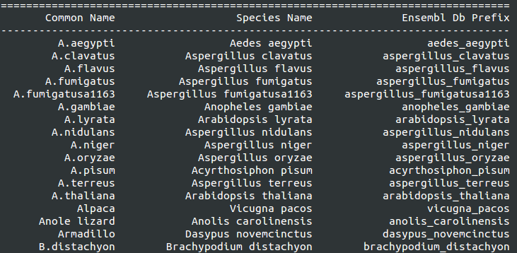

## Final-Project
Gabriela M. de Pinho

### Background and biological question

Vocal communication ability is found in teleost fishes, frogs and toads, mammals, turtles, lizards, and birds, but is not universal among vertebrates (Adkins-Regan, 2005). Among the vocal vertebrates, some groups have the additional capacity for vocal learning, and include parrots, hummingbirds, songbirds, macaques, humans, some bats, cetaceans and elephants (Condro & White, 2014; White, 2010). Vocal learning, a sub-component of language, is the ability of an individual to modify its own vocalization from observing and mimicking a vocal model (Teramitsu, Kudo, London, Geschwind, & White, 2004), and apparently evolved independently in several lineages (Jarvis et al., 2014). Among vocal-learners, the zebra finch (a songbird) is the principal model species for studies on the internal mechanisms that influence vocalization and leaning (Condro & White, 2014; Remage-Healey, 2012).


Figure 1: A male and a female zebra finch.

Pfenning et al. (2014) used anatomical gene-expression specialization trees---i.e. hierarchically organized brain regions, subregions and their gene expression profiles---to identify particularities of the three lineages of avian vocal learners, and of humans in relation to vocal non-learners. As result, they found that all vocal-learning birds and humans show convergent gene expression specialization in regions that control behavior, which was absent in vocal non-learners, and concluded that avian vocal-learners can be used as models for speech at a molecular level (Pfenning et al., 2014). There are three studies describing genes related to vocal learning or regulated by vocalization. First, Hilliard et al. (2012) described approximately 2,000 genes regulated during vocal behavior, and described pathways related with vocalization in songbirds from gene expression data. Also observing differantial gene expression patterns in the brain of vocal learners and nonlearners, Whitney et al. (2014) performed a more detailed study, analyzing several specific regions of the brain. Finally, Zhang et al. (2014) compared orthologous genes between genomes of vocal-learning and non vocal-learning birds and found non-synonymous mutations and accelerated genomic elements associated with language-related genes exclusive to the lineages of vocal learners.  

From evidence of convergent evolution in behavior, anatomy and gene expression among vocal learning species, we can infer that the molecular mechanisms that evolved to allow this trait are also similar and justify the expectation that the language-related genes described in birds are homologous in mammals, with similar functions. Therefore, the list of genes related to vocal learning traits provided by previous studies allow wide genome associations in mammals. The correlation of the variability in the sequence of homologous genes in mammals and the knowledge about the natural history of each species might help to elucidate the causes of differences among species-communication skills. Therefore, my general objective is to use a gene candidate approach in species of vocal learning and non vocal learning mammals. To achieve this objective, I first need to get information about the genes that were described from those three publications. For the purposes of this course, I intend to write code to compile the three independent lists of genes associated with vocal-learning, excluding duplicates and retrieving the sequence of each gene. I will also investigate any patterns among these genes.
  
---

###Dealing with tables

Having all tables downloaded from the supplemental material of each paper, I processed them to be in the same format (same order, number and name of columns) using python, shell and R. The papers can be found at the following URLs.

* [Hilliard et al (2012)](http://dx.doi.org/10.1016/j.neuron.2012.01.005)
* [Zhang et al (2014)](http://dx.doi.org/10.1126/science.1251385) 
* [Whitney et al (2014)](http://dx.doi.org/10.1126/science.1256780) 

```python
from pandas import DataFrame, read_csv
import pandas as pd
```
* Hilliard et al (2012) had more information than I needed, and to process it I used R. The script is in the repository as `Organizing_tables.R`.

* Zhang et al (2014) had two tables of interest (one with 227 and the other 278 genes), with different organization (processed in python):  

```python
Zhang1 = pd.read_csv("Zhang-Table_S28.txt", delim_whitespace=True, header = 1)
Zhang1 = Zhang1.rename(columns={"GeneSymbol": "GeneInfo"})
Zhang1["GeneInfo"].to_csv("Zhang1_GeneInfo.csv", index=False, header = True)
```

The other table was a bit more confused, so I used regular bash expressions to select the information I was interested (geneID):

```shell
grep -o -E "ENST[A-Z 0-9]*" Zhang-Table_S34.txt > ZhangS34_GeneID.csv
```
```python
Zhang2 = pd.read_csv("ZhangS34_GeneID.csv", names = ["GeneInfo"])
Zhang2.to_csv("Zhang2_GeneInfo.csv", index=False, header = True)
```

* Whitney et al (2014) in python:

```python
Whitney = pd.read_csv("Whitney_TableS4.csv", header = 2)
Whitney = Whitney.rename(columns={"Symbol": "GeneInfo"})
Whitney["GeneInfo"].to_csv("Whitney_GeneInfo.csv", index=False, header = True)
```

The lengths of all tables were checked against the information provided in the manuscripts to be sure nothing was going wrong with my code. At this point I have four tables comprising one column with the name "GeneInfo". In this column the information about the genes can be a gene symbol (e.g. BRCA2) or a gene ID (e.g. ENSG00000168883).

---

### How to eliminate duplicates within each file and make only one file

I made a function for that, it is in the repository.

```python
run function_get_uniqueGenes.py

import glob
alltables = glob.glob("*.csv") # it selects all the four tables
get_uniqueGenes (alltables, "NoDuplicates_final", "GeneInfo") 
# run the function with those tables, detailed explanation about this function can be found in the file

# output: Analyzed tables: ['Probes_vocalization_Hilliardetal2012_GeneInfo.csv', 'Zhang1_GeneInfo.csv', 
#'Whitney_GeneInfo.csv', 'Zhang2_GeneInfo.csv']. Initial lengths of tables: [4161, 227, 24498, 331]. Unique genes per list: 
#[2056, 227, 10253, 284]. Size of the final list is: 10726.
```

The file `NoDuplicates_final.csv` was generated. It contains a column (named "GeneInfo") without duplicates, with gene symbols or IDs, depending on what was made available by the authors. This file is also available in the repository.

---

### Get the whole sequence of genes from ensembl.org

Ensembl makes their data available via MySQL servers, which can be accessed by cogent.db.ensembl module in PyCogent. PyCogent is a software library for genomics that uses Python language. This program's installation has several requirements, and some details for querying databases. The script used to install this and other software is in the document `Pycogent_install.sh`, also in the repository.

*Species* is a module in cogent.db.ensembl that lets us know which species have a genome available in the database. In the case that a desired species is not found in this list, it is possible to add new species or to change the names within it (for more information click [here](http://pycogent.org/examples/query_ensembl.html)).

```python
from cogent.db.ensembl import Species 
print Species
```



Figure 2: An example of part of the table containing the species with available genomes. 

Zebra finch is included! (Common Name:Zebra finch, Species Name: *Taeniopygia guttata*, Ensembl Database Prefix: "taeniopygia_guttata")

---

To get the gene sequences from Ensembl using gene symbol and gene ID, I developed the function `get_geneseq`.

Observation: some gene IDs were published with the prefix "SYM", which hinders matching in Ensembl. I removed it with regular expressions using the find/replace in gedit (find:`SYM(ENST[A-Z 0-9]*)` replace: `\1`).

```python
run function_get_geneseq.py

get_geneseq("NoDuplicates_final.csv", "Run1", "GeneInfo", species= "taeniopygia_guttata", Rel =78)
```

This function generated the document `Run1.csv`, available in the compressed archive `Files_generated_by_function_get_geneseq_and_read_in_get_finaltable.7z`. This file has three columns called "GeneInfo", "StableID" and "DNAseq". From 10,724 genes, it was not able to get the sequences for 1,174 genes. To check for the genes in "GeneInfo" without sequences I did the following:

```python
GeneSeq1 = pd.read_csv("Run1.csv", header = 0) #read the document generated by the function get_geneseq
No_seq1 = GeneSeq1[GeneSeq1["StableID"] == "No_ID"] #get genes without sequences
No_seq1["GeneInfo"].to_csv("No_seq1.csv", index=False, header = True) #make a new file containing only genes without sequences
```

I ran the same function with the genes that I didnt find sequences for the first time. Here I got another 15 sequences, which indicates that there is a problem in the network connection with the database (however, only a small problem, as I got the majority of data the first time).

```python
get_geneseq("No_seq1.csv", "Run2", "GeneInfo", species= "taeniopygia_guttata", Rel =78)
```

I again made a file with the genes without sequences, this time, called `No_seq2.csv`. Some gene IDs or symbols could be found using the human genome as reference. All the No_seq\*.csv tables are available in the compressed archive `List_genes_without_sequences_used_in_function_get_geneseq.tar.gz`.

```python
GeneSeq2 = pd.read_csv("Run2.csv", header = 0)
No_seq2 = GeneSeq2[GeneSeq2["StableID"] == "No_ID"]
No_seq2["GeneInfo"].to_csv("No_seq2.csv", index=False, header = True)

get_geneseq("No_seq2.csv", "Run3", "GeneInfo", species = "homo_sapiens", Rel =79) # same function but with the human genome
```

Only 348 genes have no sequences now. With a smaller table to analyze, I could notice some problems in the database. First, I removed the items from the column "GeneInfo" that clearly were not genes (17 cases of dates in the format "12-April", were easily removed with regular expressions). Also, genesIDs starting with "LOC" were removed (using `LOC[0-9]*\n` in gedit), as their function are not well defined and there is a possibility of being non coding areas. There were 206 LOC genes.

I found some problems with the gene symbols described by Whitney et al 2014 (they were not being found even manually in the websearch in Ensembl). Fortunately, the authors also provided the gene IDs for each gene symbol, so I retrieved them using: 

```python
Whitney = pd.read_csv("Whitney_TableS4.csv", header = 2) # Whitney_TableS4.csv is the table I used to select the gene symbles initially (begining of the code)

GeneSeq3 = pd.read_csv("Run3.csv", header = 0)
No_seq3 = GeneSeq3[GeneSeq3["StableID"] == "No_ID"]
No_seq3["GeneInfo"].to_csv("No_seq3.csv", index=False, header = True)
Symbol = pd.read_csv("No_seq3.csv", header = 0) #yes, I had to create and read the table. My for loop was not working only with No_seq3["GeneInfo"]

XP = []
for i in range(len(Symbol)):
    a = re.search("XP_[A-Z.0-9]*", str(Symbol.loc[i])) #regular expression to capture the gene symbols with problems in the table (for exemple XP_002188032.1)
    if a != None:
        XP.append(a.group())

XP_symbols_ID = Whitney["ENSEMBL ID"][Whitney["Symbol"].isin(XP)] #getting the gene IDs for each match
XP_symbols_ID.to_csv("XP_symbols_ID.csv", index=False, header = True) #writing the table

get_geneseq("XP_symbols_ID.csv", "Run4", "ENSEMBL ID", species= "taeniopygia_guttata", Rel =78) # all gene IDs had a gene sequence, it worked very well
```

I also used the chicken genome, but it added only 3 sequences to my table.

```python
get_geneseq("No_seq3.csv", "Run5", "GeneInfo", species = "gallus_gallus", Rel =79)
```
---

### Concatenating the results from different runs

I wrote a small function for that.

```python
def get_finaltable (imput_list_tables):
    Final_table = pd.DataFrame() #create an empty dataframe
    for file in allruns:
        read = pd.read_csv(file, header = 0)
        Seq = read[read["StableID"] != "No_ID"] #select genes that have sequences
        Final_table = Final_table.append(Seq) #concatenating the tables
    seq = Final_table[["StableID", "DNAseq"]] #excluding the first column. "GeneInfo" is not important anymore, as I have one column with the gene ID of all genes.
    seq.to_csv("Sequences.csv", index=False, header = True)
    get_uniqueGenes ("Sequences.csv", "Final_table", "StableID") #runing the function to exclude duplicates because different tables could have been called a same gene with different names (symbol or ID)
    print "Done!"

allruns = glob.glob("Run[1-5].csv")
get_finaltable (allruns, "Final_table")

#output: Only one table was analyzed. Initial length the table: 11633. Unique genes in the list: 9849. "Done!"
```

Only 46 genes remained without sequences (less than 1%), so the objective was accomplished! One example of a gene that didnt work is "ZGC:113518". Looking in Ensembl database, they call it a synonymous name, and I did not find a way to get the gene ID or symbol from it. Also, IDs like "ENSGALT00000005719" are of transcripts, so I also did not find a way to solve those (however I am sure I will find after some more digging). Others could not be found even searching manually in the website, which I think are typos or names not related with genes (wrongly selected by my code).

---

### Data visualization

After getting the sequences, I wanted to visualize if there are any distinct clusters of similarity among genes, and to know how similar the sequences of the genes related to vocalization were. Clusters could possibly be related with gene families or simply similarity due to base composition.

Firstly, it is necessary to calculate the genetic distances among sequences. The sequences retrieved from Ensembl are from different genes, and therefore are unalignable. An approach to estimate genetic distances from unalignable sequences is the alignment free clustering, used by the 'Feature Frequency Profile (FFP)' program. The final output is a distance matrix among genes.

The `Final_table.csv` file was too large for the capacities of my computer (consumed all my RAM!), so I had to reduce it. The "shuf" command choses random lines, I chose to run ~50% of the data (5,000 lines).

```shell
shuf -n 5000 Final_table.csv > tab5000.csv # -n is the number of lines you want to choose

# Convert the csv file to a fasta file
awk 'BEGIN {FS=","} {print ">"$1"\n"$2}' tab5000.csv > seq5000.fasta
```

Installation of the FFP program:

```shell
wget 'http://sourceforge.net/projects/ffp-phylogeny/files/ffp-3.19.tar.gz'
tar -xzf ffp-3.19.tar.gz #extracts the compressed archive
cd ffp-3.19
./configure --disable-gui #create system specific configuration files that will be read by the compiler
make #this is a command compiles the program (it is now executable in the source folder (called src))
sudo make install #this installs system wide (It can be run from any directory because it is now copied in the root)
```

Running FFP:

```shell
ffpry -m -d -l 3 seq5000.fasta | ffpcol -d | ffprwn | ffpjsd > matrix3.txt
# -m is to do multiple comparisons, -d standard ACTG coding, -l is length of the substring to be compared among sequences. ffpcol, ffprwn, ffpjsd are programs that format the output of others to make a matrix with the genetic distance among genes.
```

##### Multidimensional scaling of the dissimilarity among genes related with vocalization

From the dissimilarity matrix exported by FFP, I used multidimensional scaling to visualize the possible groups among genes. ggplot does not recognize class structure from the multidimensional scaling function in R (cmdscale), so I installed and used ggfortify. ggfortify is a supplemental package to ggplot.

```r
library(ggplot2)
library(devtools) #required to install packages from github
install_github('sinhrks/ggfortify')
library(ggfortify)

tab <- as.matrix(read.table(file="matrix3.txt")) #load matrix

pc <- cmdscale(tab, eig = TRUE) #perform the multidimensional scaling in the form of a list

autoplot(pc, colour = 'darkgreen', alpha=0.2, size = 4, main = 'Dissimilarities amongst genes', xlab = 'Dimension 1', ylab = 'Dimension 2') #ggfortify function to plot the data

ggsave("mdsplot.png") #save plot to file
```


Figure 3: Multidimensional scaling of the dissimilarity among genes

Well, this was not exactly what I was expecting. Here we see only one big cluster of similar genes, while few outliers are quite dissimilar. I expected distinct clusters because of the different gene families involved with vocal learning, as several pathways are necessary for this trait. I did not test different alignment-free distance measures, so maybe others would describe better my data. Due to limitations in my laptop, I was only able to use a short substring length (3) to compare sequences, but longer lengths may show a different pattern. 